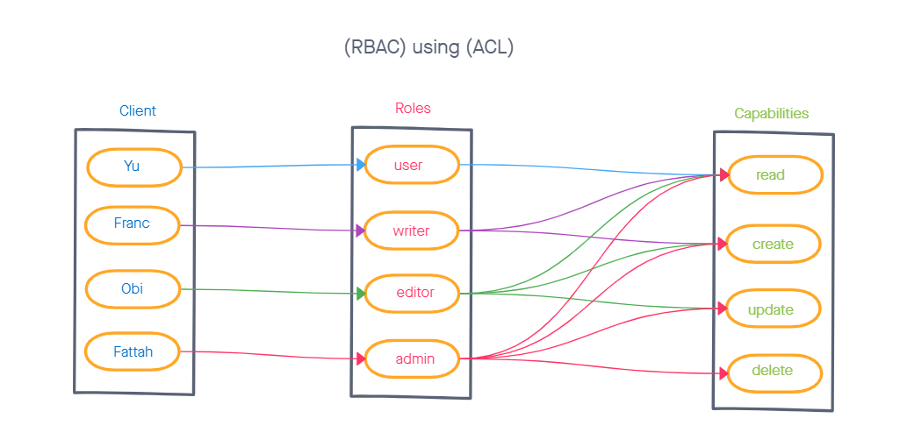

# auth-api

## Lab: Access Control

- implement Role Based Access Control (RBAC) using an Access Control List (ACL), allowing to not only restrict access to routes for valid users, but also based on the individual permissions we give each user.

## Name: Louis Lassegue

## Setup

- Task 1: Combine two servers into a single server
- Task 2: Create a new set of “Protected” API routes
  - Restrict access without a valid token AND a specific capability.
- Task 3: Apply best practices and quality engineering
  - Full Test Coverage
  - UML and WRRC Diagrams

## Routes

### - /users
  #### - GET
  - Status Code (200)
  - JSON Data response:
    - (userModel) data:
      - username: STRING
      - password: STRING
      - roles: ENUM
      - token: VIRTUAL
      - capabilities: VIRTUAL

### - /secret
  #### - GET
  - Status Code (200)
  - string response:
    
### - /signup   
  #### - POST
  - Status Code (201)
  - JSON Data response:
    - Creates new (users) data

### - /signin   
  #### - POST
  - Status Code (200)
  - JSON Data response:
    - Creates token (users) data

## UML

## Links

[Heroku Link](https://louis-auth-api.herokuapp.com/)

